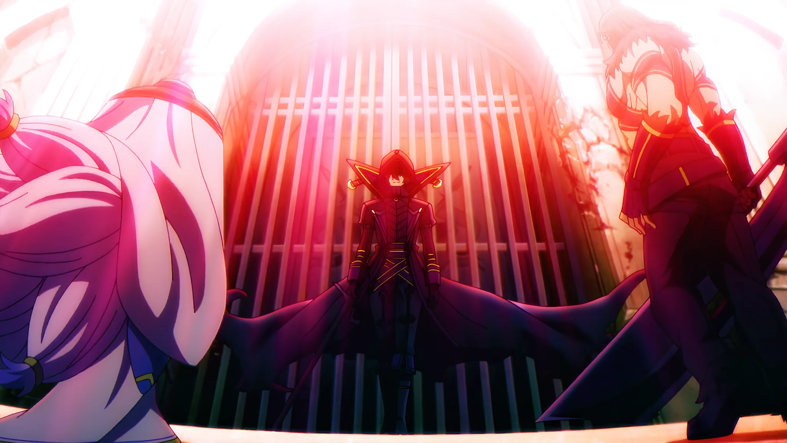
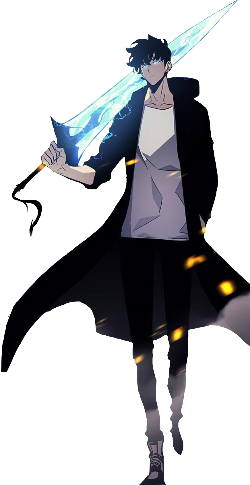

  

  

  <h3>ようこそ、KyotaFill のラボへ</h3>
  
AI, machine learning, computer vision, and connected systems.

## About me

<table>
  <tr>
    <td width="34%" align="center">
      
    </td>
    <td width="66%">
      <pre>
Profile Version : 4.0
Alias           : KyotaFill
Name            : Trần Trung Kiên
Role            : AI/ML and IoT Student
Education       : University of Economics Ho Chi Minh City
Location        : Ho Chi Minh City, Vietnam

Main focus:
  - Computer vision and applied machine learning
  - Full-stack products powered by AI services
  - ESP32, MQTT, automation, and connected devices
  - Developer tools for practical workflows

Languages       : Python, TypeScript, JavaScript, C++
Current mission : Turn experiments into usable systems
Mindset         : Learn. Build. Measure. Improve.
      </pre>
    </td>
  </tr>
</table>

## Languages and core tools

  
  
  
  
  
  

## AI and machine learning

  
  
  
  
  
  

## Web, desktop, and connected systems

  
  
  
  
  
  
  
  
  

## My Grinds

  
  
  

 

<table>
  <tr>
    <td width="41%" valign="top">
      <h3>KyotaFill</h3>
      
<strong>AI/ML and IoT Student</strong>

      
Building practical systems with computer vision, full-stack applications, and connected devices.

      

        <a href="https://github.com/KyotaFill?tab=repositories">Repositories</a> 
        <a href="https://github.com/KyotaFill?tab=overview&from=2026-01-01&to=2026-12-31">Contribution calendar</a> 
        <a href="https://github.com/KyotaFill?tab=stars">Recently starred repositories</a>
      

      <pre>
class     : builder
focus     : AI / CV / IoT
location  : Ho Chi Minh City
status    : learning and shipping

current tracks:
  - model evaluation
  - backend architecture
  - ESP32 automation
  - MLOps foundations
      </pre>

      
<strong>Favorite genres</strong>

      
Mystery, Psychological, Action, Fantasy, Adventure, Sci-Fi

    </td>
    <td width="59%" valign="top">
      <h3>Favorite anime</h3>
      
30 series represented by their protagonists. Hover over a portrait to see the title and character.

      

        
        
        
        
        
        
        
        
         
        
        
        
        
        
        
        
        
         
        
        
        
        
        
        
        
         
        
        
        
        
        
        
        
      

      
Images and anime metadata are served by <a href="https://kitsu.io/">Kitsu</a>.

    </td>
  </tr>
</table>

## Current quest

- Improving model evaluation and the reliability of computer-vision pipelines.
- Designing cleaner APIs, deployment workflows, and MLOps foundations.
- Connecting AI applications with automation and embedded systems.
- Building complete products instead of isolated technical demos.

## Statistics

  

  

  

  

  

  Visual artwork supplied by the profile owner for personal profile presentation. Rights remain with the respective creators and owners. 
  Layout inspired by <a href="https://github.com/debasishray16">debasishray16</a> and independently adapted for KyotaFill.

