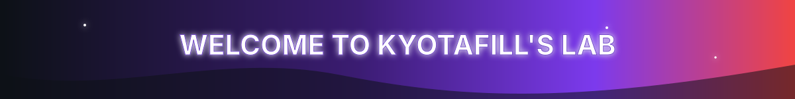
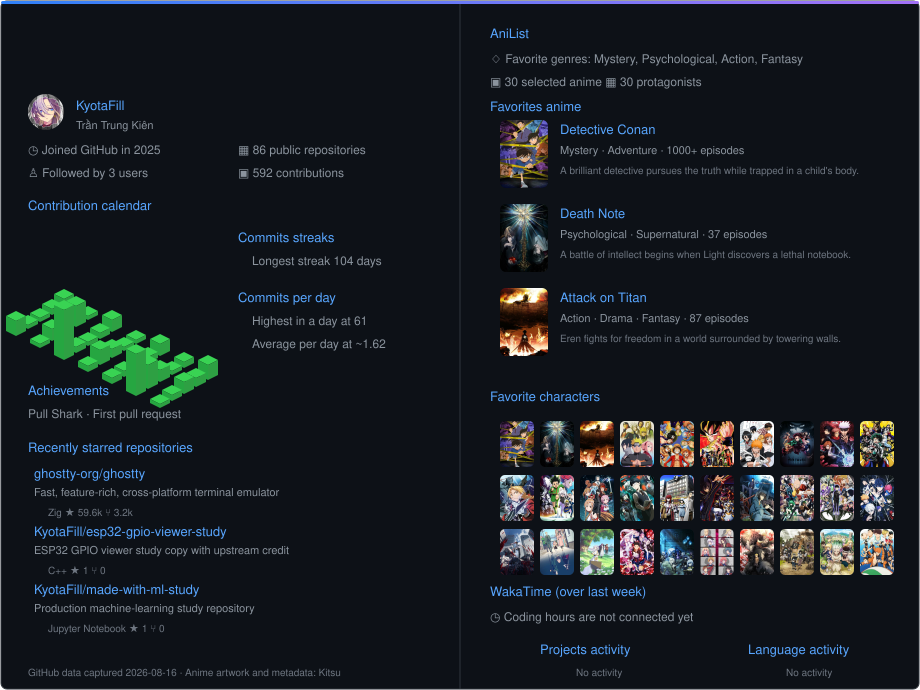

  

  

  <h3>ようこそ、KyotaFill のラボへ</h3>
  
AI, machine learning, computer vision, and connected systems.

## About me

<table width="100%">
  <tr>
    <td align="center">
      
    </td>
  </tr>
  <tr>
    <td>
      <pre>
Profile Version : 4.0
Alias           : KyotaFill
Name            : Trần Trung Kiên
Role            : AI/ML and IoT Student
Education       : University of Economics
                  Ho Chi Minh City
Location        : Ho Chi Minh City, Vietnam

Main focus:
  - Computer vision and applied
    machine learning
  - Full-stack products powered by
    AI services
  - ESP32, MQTT, automation, and
    connected devices
  - Developer tools for practical
    workflows

Languages       : Python, TypeScript,
                  JavaScript, C++
Current mission : Turn experiments into
                  usable systems
Mindset         : Learn. Build. Measure. Improve.
      </pre>
    </td>
  </tr>
</table>

## Languages and core tools

  
  
  
  
  
  

## AI and machine learning

  
  
  
  
  
  

## Web, desktop, and connected systems

  
  
  
  
  
  
  
  
  

## My Grinds

  
  
  

 

  

## Current quest

- Improving model evaluation and the reliability of computer-vision pipelines.
- Designing cleaner APIs, deployment workflows, and MLOps foundations.
- Connecting AI applications with automation and embedded systems.
- Building complete products instead of isolated technical demos.

## Statistics

  

  

  

  

  

  Visual artwork supplied by the profile owner for personal profile presentation. Rights remain with the respective creators and owners. 
  Layout inspired by <a href="https://github.com/debasishray16">debasishray16</a> and independently adapted for KyotaFill.

